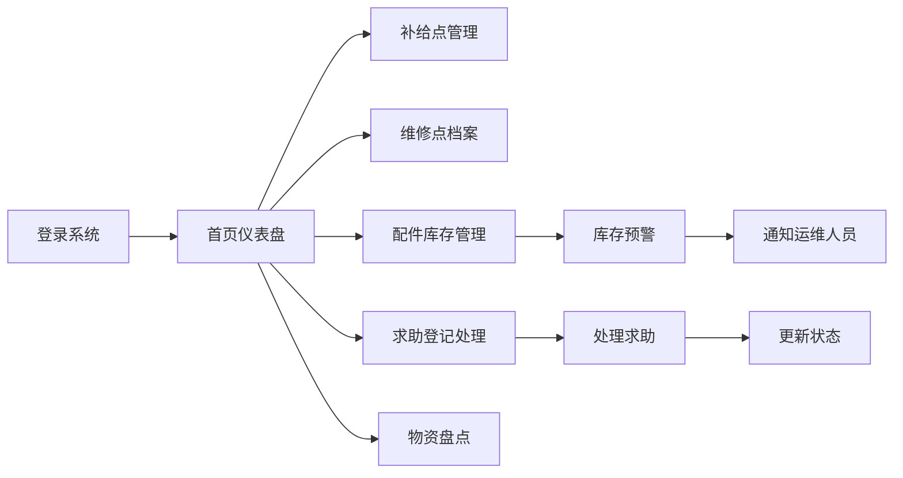

## 1. 产品概述
城市单车骑行补给站点台账系统，用于管理城市骑行沿途的补给站点、维修点、配件库存、求助登记和物资盘点，提升骑行服务管理效率。
- 面向城市骑行管理部门、运维人员，实现精细化的站点物资管理和骑行服务保障
- 价值：数字化管理骑行补给网络，快速响应求助需求，智能预警库存不足

## 2. 核心功能

### 2.1 用户角色
| 角色 | 注册方式 | 核心权限 |
|------|----------|----------|
| 系统管理员 | 后台登录 | 全部功能权限、用户管理、系统配置 |
| 运维人员 | 后台登录 | 补给点/维修点管理、库存管理、求助处理、盘点操作 |

### 2.2 功能模块
1. **首页仪表盘**：数据概览、库存预警提醒、待处理求助
2. **补给点管理**：沿途补给点信息录入、编辑、删除、查询
3. **维修点档案**：维修点信息管理、维修人员配置
4. **配件库存**：维修配件入库、出库、库存查询、库存预警
5. **求助登记**：骑行求助信息登记、处理状态跟踪
6. **物资盘点**：站点物资盘点记录、盘点差异分析

### 2.3 页面详情
| 页面名称 | 模块名称 | 功能描述 |
|----------|----------|----------|
| 首页仪表盘 | 数据概览 | 站点总数、库存预警数、待处理求助数、今日盘点统计 |
| 首页仪表盘 | 快捷入口 | 快速导航至各功能模块 |
| 补给点管理 | 列表展示 | 补给点列表、多条件筛选（区域、类型、状态） |
| 补给点管理 | 信息维护 | 新增/编辑补给点（名称、地址、类型、联系人、电话、经纬度） |
| 维修点档案 | 列表展示 | 维修点列表、按区域/等级筛选 |
| 维修点档案 | 信息维护 | 新增/编辑维修点（名称、地址、等级、维修范围、人员配置） |
| 配件库存 | 库存列表 | 配件库存查询、低库存预警标识 |
| 配件库存 | 出入库管理 | 配件入库登记、出库登记、库存变动记录 |
| 求助登记 | 求助列表 | 骑行求助信息、状态筛选（待处理/处理中/已完成） |
| 求助登记 | 求助处理 | 登记求助信息、更新处理状态、记录处理结果 |
| 物资盘点 | 盘点列表 | 盘点记录查询、按站点/时间筛选 |
| 物资盘点 | 盘点操作 | 新建盘点单、录入实盘数量、生成盘点差异报告 |

## 3. 核心流程

## 4. 用户界面设计

### 4.1 设计风格
- **主色调**：户外清爽蓝色系 (#4CAF90 青绿)，搭配天空蓝 (#87CEEB) 和草地绿 (#90EE90)
- **辅助色**：橙色 (#FF9800) 用于预警提醒，绿色 (#4CAF50) 用于正常状态，红色 (#F44336) 用于紧急状态
- **按钮样式**：圆角矩形按钮，带有微阴影，悬停时有轻微上浮效果
- **字体**：使用 "PingFang SC", "Microsoft YaHei", sans-serif，标题字号 18-24px，正文字号 14px
- **布局风格**：顶部导航 + 左侧菜单 + 右侧内容区，卡片式布局，清爽简约
- **图标风格**：线性图标，使用 Element UI 内置图标，配色与主题一致

### 4.2 页面设计概览
| 页面名称 | 模块名称 | UI 元素 |
|----------|----------|----------|
| 首页仪表盘 | 数据概览 | 统计卡片（渐变色背景）、预警列表（醒目标识）、环形进度图 |
| 补给点管理 | 列表页 | 搜索筛选栏（多条件）、数据表格（斑马纹）、操作按钮组 |
| 补给点管理 | 表单弹窗 | 分区表单、地图选点（可选）、表单验证提示 |
| 配件库存 | 库存列表 | 库存预警行（红色背景高亮）、库存进度条、出入库快捷按钮 |
| 求助登记 | 求助列表 | 状态标签（不同颜色）、紧急程度标识、处理时间线 |
| 物资盘点 | 盘点表单 | 盘点项列表、实盘数量输入、差异自动计算、结果预览 |

### 4.3 响应式
- 桌面端优先设计，适配 1280px 及以上分辨率
- 左侧菜单可折叠，适配小屏幕显示
- 表格支持横向滚动，确保在较窄屏幕上的数据完整性

### 4.4 交互细节
- 页面加载时元素淡入动画，按区域依次显示
- 表格行悬停时背景色微变，高亮选中行
- 表单输入时实时验证，错误提示友好
- 库存预警项有呼吸灯效果，提醒用户关注
