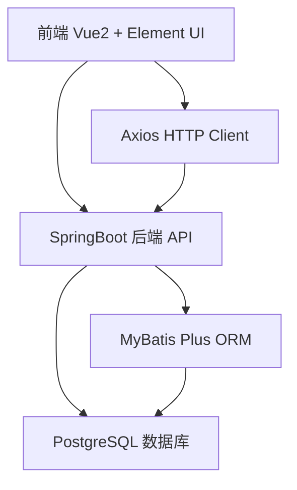
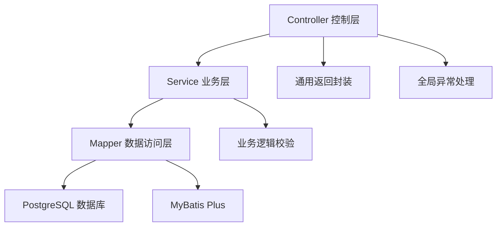
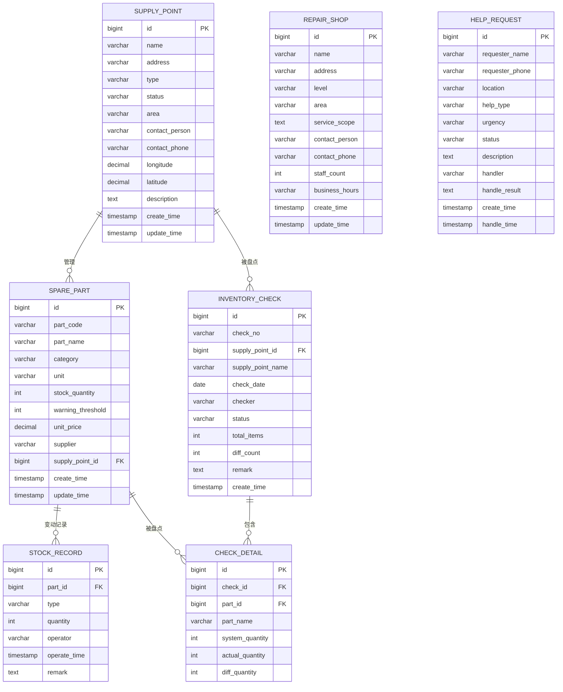

## 1. 架构设计


## 2. 技术描述

### 2.1 前端技术栈
- **框架**: Vue 2.7.x
- **UI 组件库**: Element UI 2.15.x
- **构建工具**: Vue CLI 5.x / Vite 2.x
- **路由**: Vue Router 3.x
- **状态管理**: Vuex 3.x
- **HTTP 客户端**: Axios 1.x
- **图表**: ECharts 5.x

### 2.2 后端技术栈
- **框架**: Spring Boot 2.7.x
- **ORM**: MyBatis Plus 3.5.x
- **数据库**: PostgreSQL 14.x
- **连接池**: Druid 1.2.x
- **接口文档**: Knife4j 4.x
- **工具库**: Hutool 5.x

### 2.3 项目结构
```
project-root/
├── frontend/                    # Vue2 前端项目
│   ├── public/
│   ├── src/
│   │   ├── api/                 # API 接口定义
│   │   ├── assets/              # 静态资源
│   │   ├── components/          # 公共组件
│   │   ├── router/              # 路由配置
│   │   ├── store/               # Vuex 状态管理
│   │   ├── styles/              # 全局样式
│   │   ├── utils/               # 工具函数
│   │   ├── views/               # 页面组件
│   │   ├── App.vue
│   │   └── main.js
│   ├── package.json
│   └── vue.config.js
└── backend/                     # SpringBoot 后端项目
    ├── src/
    │   ├── main/
    │   │   ├── java/com/bike/
    │   │   │   ├── common/      # 通用模块
    │   │   │   ├── config/      # 配置类
    │   │   │   ├── controller/  # 控制层
    │   │   │   ├── entity/      # 实体类
    │   │   │   ├── mapper/      # 数据访问层
    │   │   │   ├── service/     # 业务逻辑层
    │   │   │   └── BikeApplication.java
    │   │   └── resources/
    │   │       ├── mapper/      # MyBatis XML
    │   │       ├── application.yml
    │   │       └── db/          # 数据库脚本
    │   └── test/
    └── pom.xml
```

## 3. 路由定义

| 路由 | 页面 | 说明 |
|------|------|------|
| /login | 登录页 | 用户登录 |
| /dashboard | 首页仪表盘 | 数据概览 |
| /supply | 补给点管理 | 补给点列表、新增、编辑 |
| /repair | 维修点档案 | 维修点列表、新增、编辑 |
| /inventory | 配件库存 | 库存列表、出入库管理 |
| /help | 求助登记 | 求助列表、处理 |
| /inventory-check | 物资盘点 | 盘点记录、新建盘点 |

## 4. API 定义

### 4.1 通用响应结构
```typescript
interface ApiResponse<T> {
  code: number;
  message: string;
  data: T;
}
```

### 4.2 补给点接口
```typescript
// 补给点实体
interface SupplyPoint {
  id: number;
  name: string;
  address: string;
  type: string; // '饮水点' | '休息站' | '充电站' | '综合补给'
  status: string; // '正常' | '维护中' | '关闭'
  area: string;
  contactPerson: string;
  contactPhone: string;
  longitude: number;
  latitude: number;
  description: string;
  createTime: string;
  updateTime: string;
}

// GET /api/supply-points - 分页查询
// POST /api/supply-points - 新增
// PUT /api/supply-points/{id} - 更新
// DELETE /api/supply-points/{id} - 删除
```

### 4.3 维修点接口
```typescript
interface RepairShop {
  id: number;
  name: string;
  address: string;
  level: string; // '一级' | '二级' | '三级'
  area: string;
  serviceScope: string;
  contactPerson: string;
  contactPhone: string;
  staffCount: number;
  businessHours: string;
  createTime: string;
  updateTime: string;
}

// GET /api/repair-shops - 分页查询
// POST /api/repair-shops - 新增
// PUT /api/repair-shops/{id} - 更新
// DELETE /api/repair-shops/{id} - 删除
```

### 4.4 配件库存接口
```typescript
interface SparePart {
  id: number;
  partCode: string;
  partName: string;
  category: string;
  unit: string;
  stockQuantity: number;
  warningThreshold: number;
  unitPrice: number;
  supplier: string;
  supplyPointId: number;
  supplyPointName: string;
  createTime: string;
  updateTime: string;
}

interface StockRecord {
  id: number;
  partId: number;
  type: string; // 'in' | 'out'
  quantity: number;
  operator: string;
  operateTime: string;
  remark: string;
}

// GET /api/spare-parts - 分页查询（支持低库存筛选）
// GET /api/spare-parts/warning - 获取低库存预警列表
// POST /api/spare-parts - 新增配件
// PUT /api/spare-parts/{id} - 更新配件
// POST /api/spare-parts/{id}/stock-in - 入库
// POST /api/spare-parts/{id}/stock-out - 出库
// GET /api/spare-parts/{id}/records - 库存变动记录
```

### 4.5 求助登记接口
```typescript
interface HelpRequest {
  id: number;
  requesterName: string;
  requesterPhone: string;
  location: string;
  helpType: string; // '车辆故障' | '身体不适' | '物资需求' | '其他'
  urgency: string; // '低' | '中' | '高' | '紧急'
  status: string; // 'pending' | 'processing' | 'completed'
  description: string;
  handler: string;
  handleResult: string;
  createTime: string;
  handleTime: string;
}

// GET /api/help-requests - 分页查询（支持状态筛选）
// POST /api/help-requests - 新增求助
// PUT /api/help-requests/{id}/status - 更新状态
// PUT /api/help-requests/{id}/handle - 处理求助
```

### 4.6 物资盘点接口
```typescript
interface InventoryCheck {
  id: number;
  checkNo: string;
  supplyPointId: number;
  supplyPointName: string;
  checkDate: string;
  checker: string;
  status: string; // 'draft' | 'completed'
  totalItems: number;
  diffCount: number;
  remark: string;
  createTime: string;
}

interface CheckDetail {
  id: number;
  checkId: number;
  partId: number;
  partName: string;
  systemQuantity: number;
  actualQuantity: number;
  diffQuantity: number;
}

// GET /api/inventory-checks - 分页查询
// POST /api/inventory-checks - 创建盘点单
// GET /api/inventory-checks/{id} - 获取盘点详情
// POST /api/inventory-checks/{id}/complete - 完成盘点
```

### 4.7 仪表盘接口
```typescript
interface DashboardStats {
  supplyPointCount: number;
  repairShopCount: number;
  lowStockCount: number;
  pendingHelpCount: number;
  todayCheckCount: number;
  stockWarningList: SparePart[];
  pendingHelpList: HelpRequest[];
}

// GET /api/dashboard/stats - 获取统计数据
```

## 5. 后端架构


## 6. 数据模型

### 6.1 ER 图


### 6.2 DDL 语句
```sql
-- 补给点表
CREATE TABLE supply_point (
    id BIGSERIAL PRIMARY KEY,
    name VARCHAR(100) NOT NULL,
    address VARCHAR(255) NOT NULL,
    type VARCHAR(50) NOT NULL,
    status VARCHAR(50) NOT NULL DEFAULT '正常',
    area VARCHAR(100),
    contact_person VARCHAR(50),
    contact_phone VARCHAR(20),
    longitude DECIMAL(10,6),
    latitude DECIMAL(10,6),
    description TEXT,
    create_time TIMESTAMP DEFAULT CURRENT_TIMESTAMP,
    update_time TIMESTAMP DEFAULT CURRENT_TIMESTAMP
);

-- 维修点表
CREATE TABLE repair_shop (
    id BIGSERIAL PRIMARY KEY,
    name VARCHAR(100) NOT NULL,
    address VARCHAR(255) NOT NULL,
    level VARCHAR(50) NOT NULL,
    area VARCHAR(100),
    service_scope TEXT,
    contact_person VARCHAR(50),
    contact_phone VARCHAR(20),
    staff_count INT DEFAULT 0,
    business_hours VARCHAR(100),
    create_time TIMESTAMP DEFAULT CURRENT_TIMESTAMP,
    update_time TIMESTAMP DEFAULT CURRENT_TIMESTAMP
);

-- 配件库存表
CREATE TABLE spare_part (
    id BIGSERIAL PRIMARY KEY,
    part_code VARCHAR(50) UNIQUE NOT NULL,
    part_name VARCHAR(100) NOT NULL,
    category VARCHAR(50),
    unit VARCHAR(20),
    stock_quantity INT DEFAULT 0,
    warning_threshold INT DEFAULT 10,
    unit_price DECIMAL(10,2),
    supplier VARCHAR(100),
    supply_point_id BIGINT REFERENCES supply_point(id),
    create_time TIMESTAMP DEFAULT CURRENT_TIMESTAMP,
    update_time TIMESTAMP DEFAULT CURRENT_TIMESTAMP
);

-- 库存变动记录表
CREATE TABLE stock_record (
    id BIGSERIAL PRIMARY KEY,
    part_id BIGINT NOT NULL REFERENCES spare_part(id),
    type VARCHAR(20) NOT NULL,
    quantity INT NOT NULL,
    operator VARCHAR(50),
    operate_time TIMESTAMP DEFAULT CURRENT_TIMESTAMP,
    remark TEXT
);

-- 求助登记表
CREATE TABLE help_request (
    id BIGSERIAL PRIMARY KEY,
    requester_name VARCHAR(50) NOT NULL,
    requester_phone VARCHAR(20) NOT NULL,
    location VARCHAR(255) NOT NULL,
    help_type VARCHAR(50) NOT NULL,
    urgency VARCHAR(20) NOT NULL DEFAULT '中',
    status VARCHAR(20) NOT NULL DEFAULT 'pending',
    description TEXT,
    handler VARCHAR(50),
    handle_result TEXT,
    create_time TIMESTAMP DEFAULT CURRENT_TIMESTAMP,
    handle_time TIMESTAMP
);

-- 物资盘点表
CREATE TABLE inventory_check (
    id BIGSERIAL PRIMARY KEY,
    check_no VARCHAR(50) UNIQUE NOT NULL,
    supply_point_id BIGINT REFERENCES supply_point(id),
    supply_point_name VARCHAR(100),
    check_date DATE NOT NULL,
    checker VARCHAR(50) NOT NULL,
    status VARCHAR(20) NOT NULL DEFAULT 'draft',
    total_items INT DEFAULT 0,
    diff_count INT DEFAULT 0,
    remark TEXT,
    create_time TIMESTAMP DEFAULT CURRENT_TIMESTAMP
);

-- 盘点明细表
CREATE TABLE check_detail (
    id BIGSERIAL PRIMARY KEY,
    check_id BIGINT NOT NULL REFERENCES inventory_check(id),
    part_id BIGINT REFERENCES spare_part(id),
    part_name VARCHAR(100),
    system_quantity INT DEFAULT 0,
    actual_quantity INT DEFAULT 0,
    diff_quantity INT DEFAULT 0
);

-- 索引
CREATE INDEX idx_spare_part_stock ON spare_part(stock_quantity, warning_threshold);
CREATE INDEX idx_help_request_status ON help_request(status);
CREATE INDEX idx_help_request_urgency ON help_request(urgency);
CREATE INDEX idx_stock_record_part ON stock_record(part_id);
CREATE INDEX idx_check_detail_check ON check_detail(check_id);
```

### 6.3 初始化数据
```sql
-- 初始化补给点数据
INSERT INTO supply_point (name, address, type, status, area, contact_person, contact_phone, longitude, latitude) VALUES
('滨江公园补给站', '滨江区滨江公园东门', '综合补给', '正常', '滨江区', '张三', '13800138001', 120.1551, 30.2741),
('西湖休息站', '西湖区北山街88号', '休息站', '正常', '西湖区', '李四', '13800138002', 120.1562, 30.2672),
('科技园区充电站', '余杭区文一西路969号', '充电站', '正常', '余杭区', '王五', '13800138003', 120.0211, 30.2780),
('运河饮水点', '拱墅区运河广场', '饮水点', '维护中', '拱墅区', '赵六', '13800138004', 120.1456, 30.3210);

-- 初始化维修点数据
INSERT INTO repair_shop (name, address, level, area, service_scope, contact_person, contact_phone, staff_count, business_hours) VALUES
('西湖一级维修中心', '西湖区体育场路150号', '一级', '西湖区', '整车维修、配件更换、保养服务', '刘师傅', '13900139001', 8, '08:00-20:00'),
('滨江二级维修站', '滨江区江南大道100号', '二级', '滨江区', '普通维修、充气、补胎', '陈师傅', '13900139002', 4, '09:00-18:00'),
('余杭三级维修点', '余杭区余杭塘路200号', '三级', '余杭区', '简单维修、应急处理', '周师傅', '13900139003', 2, '10:00-17:00');

-- 初始化配件数据
INSERT INTO spare_part (part_code, part_name, category, unit, stock_quantity, warning_threshold, unit_price, supplier, supply_point_id) VALUES
('P001', '内胎', '轮胎类', '条', 5, 10, 35.00, '永久配件', 1),
('P002', '外胎', '轮胎类', '条', 12, 8, 85.00, '永久配件', 1),
('P003', '刹车皮', '制动系统', '对', 20, 10, 25.00, '捷安特配件', 1),
('P004', '刹车线', '制动系统', '根', 8, 15, 15.00, '捷安特配件', 2),
('P005', '链条', '传动系统', '条', 3, 5, 65.00, '禧玛诺', 1),
('P006', '脚踏', '传动系统', '副', 18, 10, 45.00, '禧玛诺', 2),
('P007', '矿泉水', '补给品', '瓶', 200, 50, 2.00, '农夫山泉', 1),
('P008', '能量棒', '补给品', '个', 15, 30, 8.00, '康比特', 1);

-- 初始化求助数据
INSERT INTO help_request (requester_name, requester_phone, location, help_type, urgency, status, description) VALUES
('小明', '13700137001', '滨江区江南大道附近', '车辆故障', '高', 'pending', '自行车链条断裂，无法继续骑行'),
('小红', '13700137002', '西湖景区苏堤', '身体不适', '中', 'processing', '骑行中感觉头晕，需要休息和饮水'),
('小刚', '13700137003', '余杭区未来科技城', '物资需求', '低', 'completed', '需要补充饮用水和能量补给');
```
